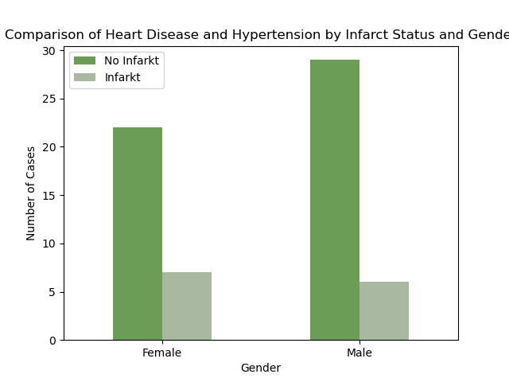

### Context:
Globally, heart attack is the second leading cause of death in the world, where approximately 11% of deaths come from heart attack.
In the provided dataset there are notes for different patients where some of them have or have not had a heart attack.
The aim is to create a classification model for heart attack and to analyze the notes of different attributes, what impact
have a heart attack.

### Atributet
<ul> ID  - Unique identifier </ul> 
<ul> Gjinia  - Age </ul> 
<ul> Mosha  - Hypertension (Yes/No) </ul> 
<ul> Hipertension  - Hypertension (Yes/No) </ul> 
<ul> Semundje_zemres  - Heart Disease (Yes/No). </ul> 
<ul> Martuar_ndonjeher  - Married (Yes/No).</ul> 
<ul> Lloji_punesimit  - Employment Type.</ul> 
<ul> Zona_jeteses  - Living Area (Urban/Rural)</ul> 
<ul> Mesatarja_glukozes_niveli -Average Glucose Level. </ul> 
<ul> bmi - Body Mass Index.</ul> 
<ul> Duhanpirja - Smoking Status </ul> 
<ul> Infarkt - Target variable (Heart Attack: 1 = Yes, 0 = No)</ul> 

 

## Play Ground
### Data interpretation

Some visual interpretation of the values in dataset

  

 Distribution of Infarct Cases by Duhanpirja |   Distribution of Infarct Cases by Gender
:-------------------------:|:-------------------------:
 |   
                                                                       |

 

### Findings:

Heavely imbalanced dataset.
Dataset is clean and does not have null values, however it is very imbalaced we have 960 instances of no heart attack vs. 62 instances of heart attack). 
 

## Solution

Implementing <b>Gradient Boosting </b>performed well as model prediction compared to Logistic Regression.   
We know that the data is imbalanced that is why we choose GradientBoosting to handle better the imbalance by implementing SMOTE technique. Furthermore the other fininds as the dataset does not have null values except the 'BMI' column we handle it by adding mean value in that cell.   
With these fininds in previous model it was easy to implement GradientBosting, where this model performed <b>accuracy of 91%. </b>   

### Interpreting results:
 As it can be seen this model predicts that the people with higher age and higher of "Niveli glugozed ne gjak" and 'BMI; have higher risks in getting heart attack. Other factors that indicate in having heart attack are also working: where stress in this case can be a factor that leads such event. Additionaly Smoking also is crucal in these maner.