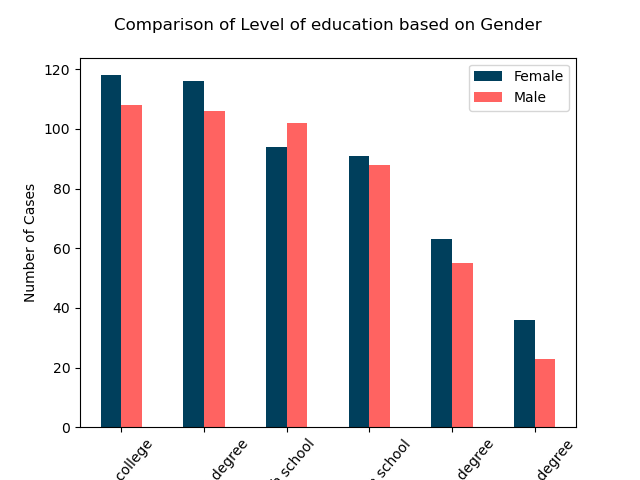
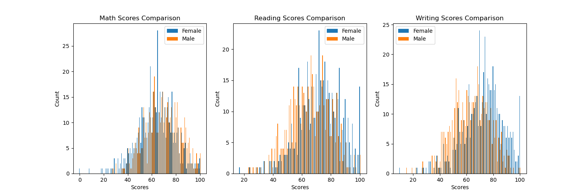
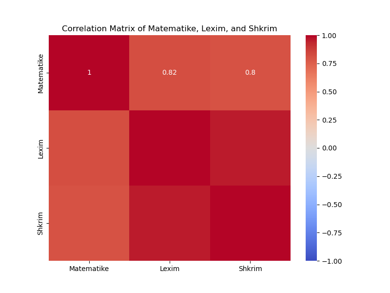

 
Ky dataset esht overview e te dhenave te nxenesve ne shkollen "XYZ". Atributed, kategorite dhe detajet rreth kesaj tabele jan me poshte.

### Atributet e Dataset:
<ul> Gjinia - String - Gjinia e nxenesit</ul>
<ul>Raca/Etniciteti - String - Grupi i Races/Etnicitetit te nxenesit</ul>
<ul>Niveli_edukimit_prindit - String - Niveli i edukimit te prinderve (me i larti nga te 2)</ul>
<ul>Shujta_drekes_pakoja - String - Lloji i pakos se ushqimit ne shkolle</ul>
<ul>Kurse_parapregaditore_ekstra - String - Indikatori se a ka qene ne ndonje kurs ekstra </ul>
<ul>Matematike - Number - Rezultati ne Matematike</ul>
<ul>Lexim - Number - Rezultati ne Lexim</ul>
<ul>Shkrim - Number - Rezultati ne Shkrim</ul>

  
Nga keto te dhena duhet te ndertojm nje model per predictive analysis dhe interpretimin e te dhenave
#### To Do:
<ul> Performance prediction </ul>
<ul> Performance of Students In Exams </ul>

<ul> Gender Prediction </ul>

<ul> Correlations between different attributes </ul>

### Solution:

#### 1. Data Preparation  
   Dataset ka 8 shtylla me 1.0000 data, nuk ka null values, or noizy data.
   Dataset eshte i pastert dhe gatshem  per te perpunu interpretation dhe model prediction.  

|  Gjinia |  Raca/Etniciteti|   Niveli_edukimit_prindit  |   Shujta_drekes_pakoja |  Kurse_parapregaditore_ekstra |  Matematike|    Lexim|  Shkrim |
|---------|-----------------|----------------------------|------------------------|-------------------------------|-- ---------|---------|---------|
|  female |       group B   |         bachelor's degree  |       standard         |        none                   |      72    |    80   |   47    |
|  male   |       group C   |       associate's degree   |          free          |            none               |       56   |   75    |    65   |

   

#### 2. Data interpretation   

  Vizualizimi me poshte interpreton te dhenat e nivelit te edukimint ne baze te gjinise. Ashtu si duket ne vizualizim vajzat e shkolles "XYZ" kane prinderit me te shkolluar sesa djemt e po kesaj shkolle.    

   

Ndersa ne vizualizimin e dyte eshte ne detaje krahasimi per 3 kategorite: Lexim, Shkrim dhe Matematike per dy gjinite se kush ka me shume pike ne keto teste. Mund te aludojme se ky rezultat i gjinise femrore te dominoje ne 3 kategorite dhe te jene me te sukseshme mund te vje edhe nga niveli i edukimit te prindit, shfaqur ne grafitin me larte.   

   

   

#### 3. Model prediction    

   <ul>3.1 Logistic Regression </ul>
Duke perdorur Logistic Regresion qe eshte model per te klassifikuar kategorite, ndertuam nje model qe predict kush eshte me i mire ne Matematike, Lexim dhe Shkrim. <b>Ky model i prediction ka accuracy ~90% qe eshte accuracy shume e qendrushme dhe premtuse.

Tabela me poshte jep nje overview te detajizuar se si ky model behaved per kete prediction.

Optimization terminated successfully.
         Current function value: 0.300722
         Iterations 8
                           Logit Regression Results                           
==============================================================================
Dep. Variable:                 Gjinia   No. Observations:                  700
Model:                          Logit   Df Residuals:                      696
Method:                           MLE   Df Model:                            3
Date:                Fri, 09 Aug 2024   Pseudo R-squ.:                  0.5645
Time:                        11:30:02   Log-Likelihood:                -210.51
converged:                       True   LL-Null:                       -483.42
Covariance Type:            nonrobust   LLR p-value:                5.593e-118
==============================================================================
                 coef    std err          z      P>|z|      [0.025      0.975]
------------------------------------------------------------------------------
const          2.2306      0.632      3.527      0.000       0.991       3.470
Matematike     0.3630      0.028     12.884      0.000       0.308       0.418
Lexim         -0.0682      0.031     -2.211      0.027      -0.129      -0.008
Shkrim        -0.3190      0.034     -9.328      0.000      -0.386      -0.252
==============================================================================

Interpretimi i resultateve:
<li> Classification report: Ky report na tregon perpikmerine, dhe F1-score per dy kategorite (female, male). </li>

<li> Coefficients: These show the direction and strength of the relationship between each feature and the probability of being female (or male, depending on the encoding). </li>

Permbledhje:
Logistic Regression Coefficients Plot: Ky chart tregon magnitude per gjinite dhe each feature’s influence per kete prediction.
Confusion Matrix: This matrix shfaq numrimin e vlerave pozitive dhe negative duke e shikuar ne thellesi se si ky model performon.

Accuracy and MSE: Keto dy vlera jan performanca e modelit, accuracy tregon saktesine ndersa MSE tregon mesataren e gabimeve qe mundet me ndodhe gjate prediction. 

Ne file solution.ipnyb jane ne detaje te spjeguara secili hape i marre per te zgjidhur kete problem.

 

<ul>3.2. Correlation of attributes </ul>
Mund te interpretojme se kategoria Matematike ka vleren me te madhe te correlations.

 

